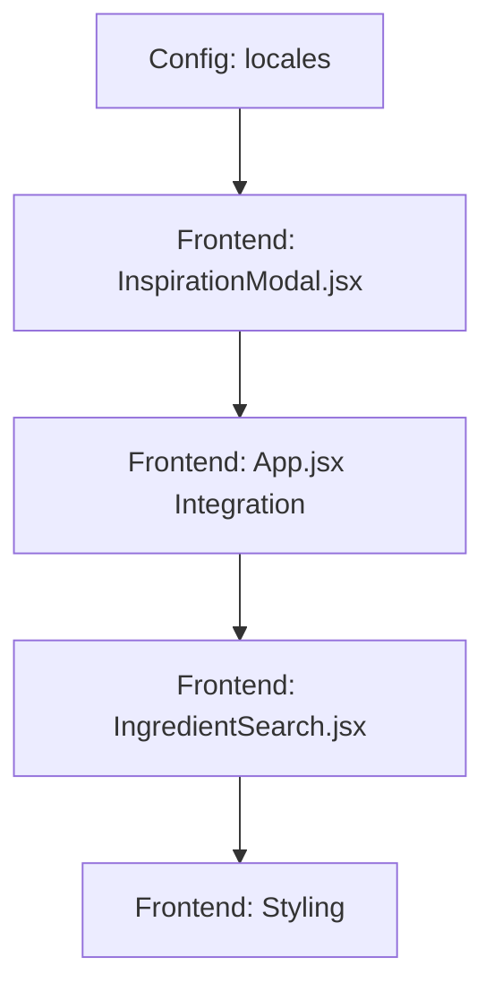

# Implementation Plan: US-10 Recommended Ingredients Inspiration

## 1. User Story Summary
**Story:** As a user, I want a "Need inspiration?" button below the ingredient input that opens a modal showing diet rules and ingredients for my current week. The modal should show allowed ingredients (categorized and clickable to add), the specific rules for the week, and a list of prohibited ingredients (not clickable).

- **Stack:** React, i18next, Vanilla CSS
- **Estimated Effort:** 2.5 hours
- **Priority:** Medium

## 2. Acceptance Criteria
- [ ] AC-1: Add "Need inspiration?" button below the ingredient input in `IngredientSearch.jsx`.
- [ ] AC-2: Create a new `InspirationModal` component that accepts `selectedWeek`.
- [ ] AC-3: Display `rules_text` for the selected week from `diet-rules.json`.
- [ ] AC-4: Display `allowed_ingredients` (resolved for the week) categorized into logical groups (Proteins, Vegetables, Grains, Fats, Boosters).
- [ ] AC-5: Clicking an allowed ingredient badge adds it to the user's list.
- [ ] AC-6: Display `forbidden_ingredients` list (not clickable) to clearly show what to avoid.
- [ ] AC-7: Modal design follows the "wellness journal" aesthetic with distinct sections for Rules, Allowed, and Prohibited.

## 3. File & Component Mapping
| Task | File Path | Layer |
| :--- | :--- | :--- |
| Add translations | `src/locales/en.json`, `src/locales/ko.json` | Config |
| Create modal UI | `src/components/InspirationModal.jsx` | Frontend |
| Update search UI | `src/components/IngredientSearch.jsx` | Frontend |
| Handle state in App | `src/App.jsx` | Frontend |
| Add modal styles | `src/App.css` | Frontend |

## 4. Dependencies & Implementation Order

1. **Phase 1: Foundation** - Update locales with titles for the new modal sections.
2. **Phase 2: Component Creation** - Implement `InspirationModal` with props for `week`, `onAdd`, and `onClose`. Use `resolveRules` from `dietValidator.js`.
3. **Phase 3: Integration** - Pass down `currentWeek` to `IngredientSearch`, add the button, and manage modal visibility in `App.jsx`.
4. **Phase 4: Polish** - Styling the modal sections (Glassmorphism, soft typography, distinct "Do" and "Don't" visual cues).

## 5. Testing Strategy
| Task | Test Type | Key Scenarios |
| :--- | :--- | :--- |
| Dynamic Content | Manual | Switch to Week 2, open modal, verify it shows Week 2 rules and "nuts/legumes" (from Week 2 rules). |
| Non-Clickable | Manual | Verify prohibited ingredients are visually distinct and NOT interactive. |
| Inheritance | Manual | Verify Week 2 modal includes Week 1 allowed foods. |

## 6. Risk Assessment
| Risk | Likelihood | Impact | Mitigation |
| :--- | :--- | :--- | :--- |
| Modal layout on mobile | Medium | Medium | Use responsive width/padding and ensure scrolling works if list is long. |
| Overlapping with existing UI | Low | Low | Ensure proper z-index and backdrop blur to separate modal from main content. |

## 7. Notes & Assumptions
- The ingredient list in the modal will be a curated static list based on diet-friendly foods.
- Clicking an ingredient should not close the modal immediately, allowing users to pick multiple.
- We will reuse the `ingredient-badge` style from `IngredientSearch` for consistency.
