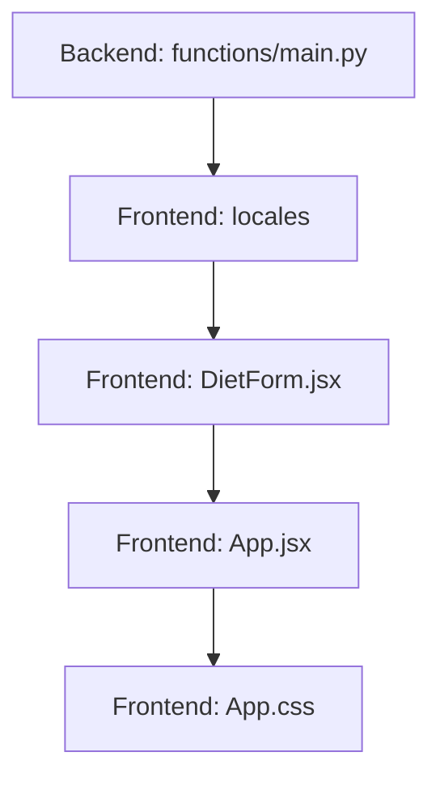

# Implementation Plan: US-9 "Chef, up to you" Recipe Generation

## 1. User Story Summary
**Story:** As a user, I want the system to create a recipe entirely based on the pre-defined allowed ingredient for my selected week, without any entry for ingredient list. I want an extra button called 'Chef, up to you' next to the current 'generate recipe'. Two button have different emoji and button color.

- **Stack:** React, Firebase Functions (Python), Gemini 2.0 Flash
- **Estimated Effort:** 2-3 hours
- **Priority:** High

## 2. Acceptance Criteria
- [x] AC-1: Add a second button "Chef, up to you" to the `DietForm` component.
- [x] AC-2: Custom styling for the new button:
    - [x] Emoji: 🧑‍🍳 (Chef) vs ✨ (Generate)
    - [x] Color: Use `var(--gradient-sage)` for Chef button vs `var(--gradient-warm)` for Generate button.
- [x] AC-3: Clicking "Chef, up to you" bypasses the "empty ingredient list" check in `App.jsx`.
- [x] AC-4: Backend `generate_recipe` function updated to handle empty or missing `ingredients` field safely.
- [x] AC-5: I18n support added for "Chef, up to you" button text in English and Korean.

## 3. File & Component Mapping
| Task | File Path | Layer |
| :--- | :--- | :--- |
| Update backend validation | `functions/main.py` | Backend |
| Add translation strings | `src/locales/en.json`, `src/locales/ko.json` | Config |
| Update DietForm UI | `src/components/DietForm.jsx` | Frontend |
| Handle click in App logic | `src/App.jsx` | Frontend |
| Add button styles | `src/App.css` | Frontend |

## 4. Dependencies & Implementation Order

1. **Phase 1: Backend Foundation** - Update `generate_recipe` to permit empty ingredients.
2. **Phase 2: UI & Logic** - Add translations, update `DietForm` with two-button layout, and modify `App.jsx` to handle both modes.
3. **Phase 3: Styling & Polish** - Apply distinct styles to the new button and verify visual parity with the mockup.

## 5. Testing Strategy
| Task | Test Type | Key Scenarios |
| :--- | :--- | :--- |
| Backend Generation | Integration | Call with `ingredients=""` and verify diet-compliant recipe returned. |
| UI Buttons | E2E | Verify "Chef, up to you" is clickable when list is empty, while "Generate Recipe" remains disabled/blocked. |
| I18n | Unit | Toggle language and verify both button texts update correctly. |

## 6. Risk Assessment
| Risk | Likelihood | Impact | Mitigation |
| :--- | :--- | :--- | :--- |
| AI produces generic recipes without ingredients | Medium | Low | Refine prompt to emphasize "use only allowed ingredients for this week". |
| UI layout breaks on small screens | Low | Medium | Use flex-wrap and responsive padding for button container. |

## 7. Notes & Assumptions
- Assumption: The "Chef" button should pass an empty string or a special indicator to the backend.
- The "Generate Recipe" button will still require at least one ingredient in the list (as currently implemented).
- Different emojis and gradients will provide clear visual distinction.
