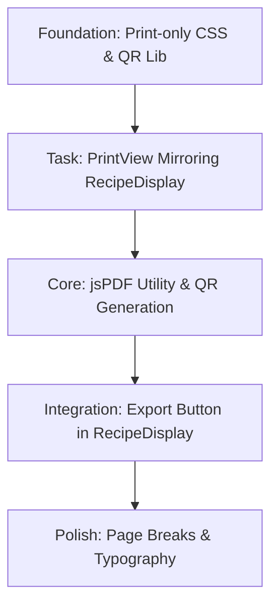

# Implementation Plan: US-8 PDF Export Refinement

## 1. User Story Summary

**Story Statement:**
As a user, I want to export my generated recipes as a print-friendly PDF that mirrors the "Wellness Journal" aesthetic, so I can save or print them for offline use.

- **Tech Stack:** React (v18+), jsPDF, html2canvas (optional but recommended for styling fidelity), CSS Media Queries (@media print).
- **Effort Estimate:** Medium (8-12 hours).
- **Priority:** Phase 5 (Final Polish).

---

## 2. Acceptance Criteria

- [ ] **AC-1:** Dedicated "Export PDF" button on the `RecipeDisplay` component.
- [ ] **AC-2:** PDF layout includes:
    - High-contrast typography (Serif headers, Sans-serif body).
    - Clear sections for Title, Health Benefit, Macros, Ingredients, and Instructions.
    - Wellness Tip section at the bottom.
- [ ] **AC-3:** Print-specific styling:
    - No background colors (ink-saving).
    - Proper A4 page breaks (avoiding cut-off text in instructions).
    - High-quality logo or header branding.
- [ ] **AC-4:** Language support: PDF content generates in the language currently active (English or Korean).
- [ ] **AC-5:** Download functionality: A single click generates and triggers the browser download.
- [ ] **AC-6:** QR Code integration: PDF includes a QR code that links back to the digital recipe URL.

---

## 3. File & Component Mapping

| Task | File Path | Layer |
|------|-----------|-------|
| Create PDF Logic Utility | `src/utils/pdfGenerator.js` | Utility |
| QR Code Component | `src/components/RecipeQRCode.jsx` | Frontend |
| Add Export Button | `src/components/RecipeDisplay.jsx` | Frontend |
| Create Print-only Styles | `src/styles/print.css` | CSS |
| Print-optimized Component | `src/components/PrintView.jsx` | Frontend |
| Update i18n for PDF | `src/locales/en.json`, `src/locales/ko.json` | Config |

---

## 4. Dependencies & Implementation Order

### Phased Implementation:

1. **Foundation:**
   - Create `src/styles/print.css` with `@media print` rules to hide UI elements (nav, buttons) and force high-contrast text.
   - Configure jsPDF with required fonts (especially for Korean characters like NanumMyeongjo).

2. **Core Logic:**
   - Implement `pdfGenerator.js` using `jsPDF`. 
   - *Strategy:* Use `html2canvas` to capture a hidden `PrintView` component for high-fidelity styling OR use `jsPDF` autoTable for a more structured, manual document construction. Given the "Wellness Journal" requirements, `html2canvas` + `jsPDF` is better for aesthetic matching.

3. **UI Integration:**
   - Build `PrintView.jsx` as a "behind-the-scenes" component that renders the recipe in a strictly A4-proportioned layout.
   - Add the "Export PDF" button to the main `RecipeDisplay`.

4. **Polish:**
   - Add logic for smart page breaks within the instructions list.
   - Refine margins and font sizes for A4 physical dimensions.

---

## 5. Testing Strategy

| Scenario | Test Type | Success Criteria |
|----------|-----------|------------------|
| Export Long Recipe | Manual/UI | Recipe spanning 2+ pages has correct header/footer and no cut-off text. |
| Language Matching | Manual | PDF language matches the UI language at the time of export. |
| QR Code Scan | Manual | QR code in exported PDF correctly redirects to the recipe URL. |
| Ink Saving Mode | Manual | Backgrounds are white and text is dark charcoal/black in the PDF. |
| Download Trigger | Integration | Clicking the button triggers a `.pdf` file download within < 3 seconds. |

---

## 6. Risk Assessment

| Risk | Likelihood | Impact | Mitigation Strategy |
|------|------------|--------|---------------------|
| Korean Font Rendering | High | High | Pre-load and embed custom TTF/WOFF fonts into jsPDF to ensure charset support. |
| Layout Shift in PDF | Medium | Medium | Use a dedicated `PrintView` component with fixed dimensions (210mm width) for rendering. |
| Large Image Sizes | Low | Low | Optimize images/logos before embedding to keep PDF size small. |

---

## 7. Notes & Assumptions

- **Assumptions:** Users have modern browsers with PDF support. The "Switch On" logo is available in SVG or PNG format. PDFs are generated in a single language based on the active UI locale.
- **Open Questions:** None.
- **Fonts:** We will likely need `NanumMyeongjo` for Korean headers to match the premium Serif aesthetic.
